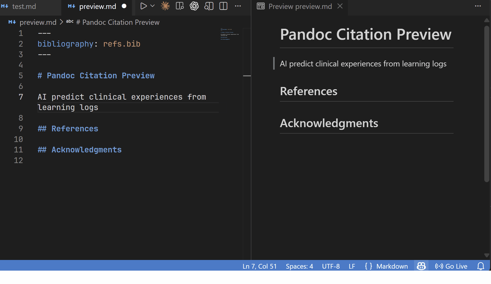

# Markdown Academic Preview

A VS Code extension that enhances the built-in Markdown Preview with academic writing features — **citations, cross-references, footnotes, subscript/superscript, and bibliography rendering** — all without requiring a Pandoc installation.

The extension follows [Pandoc's Markdown syntax](https://pandoc.org/MANUAL.html#citations) for citations and cross-references, so your documents remain fully compatible with Pandoc-based workflows. Bibliography data is parsed from BibTeX / CSL-JSON files using [citation-js](https://citation.js.org/), and everything runs entirely within VS Code.



## Features

### Citation Preview

Renders Pandoc citation syntax directly in the Markdown preview.

- **Bracket citations**: `[@smith2020]`, `[@smith2020, p. 10]`, `[@smith2020; @johnson2019]`
- **Inline citations**: `@smith2020`, `@smith2020 [p. 10]`
- **Author suppression**: `[-@smith2020]` renders only the year
- **Prefix / suffix**: `[see @smith2020, p. 10]`

### Cross-References

Supports [pandoc-crossref](https://github.com/lierdakil/pandoc-crossref) syntax for numbered references.

- **Figures**: `@fig:label`, `[@fig:label]`
- **Tables**: `@tbl:label`, `[@tbl:label]`
- **Equations**: `@eq:label`, `[@eq:label]`
- **Sections**: `@sec:label`, `[@sec:label]`
- **Listings**: `@lst:label`, `[@lst:label]`
- **Captions**: `: Caption text {#fig:label}` with automatic numbering
- **Customizable prefixes** via YAML frontmatter

### Footnotes

Renders Pandoc footnote syntax with Pandoc-compatible HTML output.

- **Reference footnotes**: `[^1]` with `[^1]: Footnote text` definitions
- **Inline footnotes**: `^[This is an inline footnote.]`
- **Multi-paragraph footnotes**: indented continuation paragraphs
- Hover over a footnote reference in the preview to see the content in a popover
- Hover over `[^id]` or `^[...]` in the editor to preview the footnote content

### Text Formatting

Renders Pandoc-style inline formatting in the preview.

- **Subscript**: `H~2~O` → H₂O
- **Superscript**: `x^2^` → x²
- **Strikethrough**: `~~deleted~~` → ~~deleted~~

### Interactive Bibliography

- Click a citation to jump to the corresponding bibliography entry
- Hover over a citation to see the full reference in a popover
- DOIs and URLs are automatically rendered as clickable links

### Citation Autocomplete

Type `@` in a Markdown file to get citation key and cross-reference suggestions. The completion list shows author, year, and title — selecting an item displays the full formatted reference.

### Insert Citation Command

Use the Command Palette (`Ctrl+Shift+P` / `Cmd+Shift+P`) and run **Markdown Academic: Insert Citation** to search and insert citations via a quick picker.

### Editor Hover

Hover over a citation key or footnote reference in the editor to preview the content in a tooltip.

### Bibliography Rendering

Renders the reference list using CSL styles (default: APA).

- Supports BibTeX (`.bib`), CSL-JSON (`.json`), and YAML (`.yaml`/`.yml`)
- Inline references via YAML frontmatter `references:` field
- `nocite` support for including uncited entries

## Usage

### 1. Specify a bibliography file in YAML frontmatter

```markdown
---
bibliography: refs.bib
---

According to @smith2020, ...

## References

::: {#refs}
:::
```

### 2. Multiple bibliography files

```yaml
---
bibliography:
  - refs.bib
  - extra.json
---
```

### 3. Inline references

You can define references directly in YAML frontmatter and cite them in the same document:

```markdown
---
references:
  - id: smith2020
    type: article-journal
    title: "Article Title"
    author:
      - family: Smith
        given: John
    issued:
      date-parts:
        - [2020]
---

According to @smith2020, this approach works well.

More details can be found in [@smith2020, p. 42].
```

This is useful for self-contained documents that don't need an external bibliography file.

### 4. Custom CSL style

```yaml
---
bibliography: refs.bib
csl: chicago-author-date.csl
---
```

### 5. nocite

Include entries in the bibliography without citing them in the text:

```yaml
---
bibliography: refs.bib
nocite: "@*"
---
```

To include specific uncited entries:

```yaml
---
bibliography: refs.bib
nocite: |
  @smith2020
  @johnson2019
---
```

### 6. Bibliography placement

By default, the bibliography is appended at the end of the document. To control placement, use the Pandoc `refs` div:

```markdown
## References

::: {#refs}
:::

## Appendix

Additional content after the bibliography.
```

### 7. Footnotes

```markdown
Text with a reference footnote[^1] and an inline footnote^[This appears at the bottom.].

[^1]: This is the footnote content.

[^long]: Multi-paragraph footnotes use indented continuation.

    Second paragraph of the footnote.
```

### 8. Cross-references

Define cross-reference targets with `{#type:label}` and reference them with `@type:label`:

```markdown

: A schematic diagram {#fig:diagram}

As shown in @fig:diagram, the system consists of ...
```

## Extension Settings

| Setting | Type | Default | Description |
|---------|------|---------|-------------|
| `markdownAcademicPreview.enabled` | boolean | `true` | Enable/disable the extension |
| `markdownAcademicPreview.defaultBibliography` | string[] | `[]` | Default bibliography file paths (loaded in addition to YAML frontmatter) |
| `markdownAcademicPreview.defaultCsl` | string | `""` | Default CSL style name (e.g. `"ieee"`) or file path |
| `markdownAcademicPreview.searchDirectories` | string[] | `[]` | Search directories for bibliography files |
| `markdownAcademicPreview.cslSearchDirectories` | string[] | `[]` | Search directories for CSL style files |
| `markdownAcademicPreview.locale` | string | `""` | Locale for citation rendering (e.g. `"en-US"`, `"ja-JP"`, `"de-DE"`) |
| `markdownAcademicPreview.popoverEnabled` | boolean | `true` | Enable citation popover tooltips in the preview |
| `markdownAcademicPreview.completionEnabled` | boolean | `true` | Enable citation key autocomplete when typing `@` |

### File path resolution

Bibliography and CSL file paths are resolved in the following order:

1. **Absolute path** — used as-is
2. **Relative to the markdown file** directory
3. **Search directories** — `searchDirectories` / `cslSearchDirectories`
4. **Workspace root**

## Supported Citation Syntax

| Syntax | Description |
|--------|-------------|
| `@key` | Inline citation (Author Year) |
| `[@key]` | Bracket citation (Author Year) |
| `[@key, p. 10]` | With locator |
| `[@key1; @key2]` | Multiple citations |
| `[-@key]` | Suppress author |
| `[see @key]` | With prefix |
| `[see @key, p. 10]` | With prefix and locator |
| `@key [p. 10]` | Inline with locator |

### Supported Locators

page, chapter, section, volume, figure, part, line, note, verse, book, column, folio, opus, sub verbo

## Supported Bibliography Formats

| Format | Extension |
|--------|-----------|
| BibTeX | `.bib` |
| CSL-JSON | `.json` |
| YAML | `.yaml`, `.yml` |
| Inline | YAML frontmatter `references:` |

## Requirements

- VS Code 1.80.0 or later
- No external dependencies required (Pandoc is **not** needed)

## License

MIT
