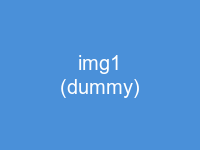
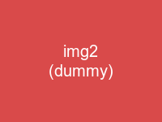

# Pandoc-Crossref Test

## Figures

{#fig:first}

{#fig:second}

See @fig:first and @fig:second for details.

As shown in [@fig:first; @fig:second], the results are clear.

## Tables

: Sample data {#tbl:data}

| A | B |
|---|---|
| 1 | 2 |

: Comparison results {#tbl:comparison}

| X | Y |
|---|---|
| 3 | 4 |

Refer to @tbl:data and @tbl:comparison.

## Equations

$$ E = mc^2 $$ {#eq:einstein}

$$ a^2 + b^2 = c^2 $$ {#eq:pythagoras}

From @eq:einstein and @eq:pythagoras, we can derive the following.

## Sections

# Introduction {#sec:intro}

# Methods {#sec:methods}

See @sec:intro for background. The approach is described in @sec:methods.

## Code Listings

```python
print("hello")
```

: Hello world {#lst:hello}

See @lst:hello for the example code.

## Mixed References

Combining crossref and bibliography citations:

As shown in @fig:first and discussed by @smith2020, the results align with [@johnson2019, p. 42].

Multiple crossrefs in bracket: [@fig:first; @tbl:data; @eq:einstein]

## Crossref Inside Code Block (should be ignored)

```
This {#fig:fake} should not be detected as a crossref definition.
```

## References

::: {#refs}
:::
